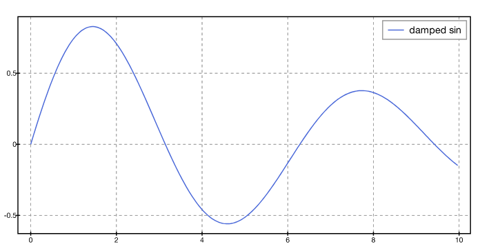
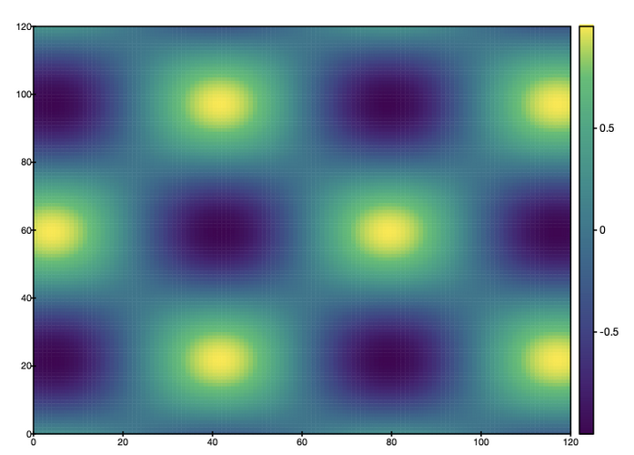

# App-PDL-Notebook

A lightweight, Jupyter-style notebook for PDL — **no ZeroMQ, no Python/Jupyter
stack, no Node-built frontend.** Just a persistent Perl interpreter, a thin
Mojolicious WebSocket relay, and one static HTML page.

```
browser (CodeMirror cells)
   │  WebSocket (JSON)
script/pdl-notebook          ← Mojolicious::Lite, relay only
   │  pipes (newline-delimited JSON)
script/pdl-notebook-kernel   ← persistent PDL interpreter, one cell at a time
```

## Quick Start

```sh
# 1. Install prerequisites
cpanm Mojolicious Lexical::Persistence

# 2. Install PDL::Graphics::Cairo from GitHub
git clone https://github.com/goosh-gh/PDL-Graphics-Cairo.git
cd PDL-Graphics-Cairo && perl Makefile.PL && make && make install
cd ..

# 3. Clone and launch the notebook
git clone https://github.com/goosh-gh/App-PDL-Notebook.git
cd App-PDL-Notebook
perl -I/path/to/PDL-Graphics-Cairo/lib script/pdl-notebook daemon
```

4. Open **http://localhost:3000** in your browser.
5. Type code in a cell and press **Shift-Enter** to run it.
6. The last expression in a cell is displayed as a result — if it is a
   `PDL::Graphics::Cairo::Figure`, it renders inline as SVG or PNG automatically.
7. `my` variables persist across cells (requires `Lexical::Persistence`).
8. Use the **✕** button to interrupt a running cell.

### Keyboard shortcuts

| Key | Action |
|-----|--------|
| Shift-Enter | Run cell |
| Ctrl-Enter  | Run cell (stay in cell) |

## Examples

End a cell with a figure object and it renders inline. The format is chosen
automatically from the figure's contents: vector **SVG** for line/scatter plots,
raster **PNG** for `imshow`/`contourf` (which would bloat as SVG).

### Line plot → inline SVG

```perl
use PDL;
use PDL::Graphics::Cairo;
my $x = sequence(300) / 30;
my ($fig, $ax) = PDL::Graphics::Cairo::subplots(1, 1, width => 800, height => 450);
$ax->line($x, sin($x) * exp(-$x/8), color => 'royalblue', label => 'damped sin');
$ax->legend();
$ax->set_grid(1);
$fig->tight_layout;
$fig;
```



### imshow → inline PNG

```perl
use PDL;
use PDL::Graphics::Cairo;
my $n  = 120;
my $x  = (sequence($n) - $n/2) / 12;
my $xx = $x->dummy(0, $n);
my $yy = $x->dummy(1, $n);
my $z  = sin($xx) * cos($yy);
my ($fig, $ax) = PDL::Graphics::Cairo::subplots();
$ax->imshow($z, cmap => 'viridis');
$fig->tight_layout;
$fig;
```



### EEG viewer — MNE `raw.plot()` style

Load real Nihon Kohden `.EEG` data (or synthetic demo) and explore it with
browser sliders. Requires [PDL::EEG](https://github.com/goosh-gh/PDL-EEG) for
real data; demo mode needs no extra modules.

```perl
use lib '/path/to/PDL-EEG/lib';
use lib '/path/to/PDL-Graphics-Cairo/lib';
use PDL;

# Demo mode (34-channel synthetic EEG, 30 s):
do '/path/to/App-PDL-Notebook/examples/notebook_eeg_raw.pl';

# Real data (Nihon Kohden .EEG):
local @ARGV = ('/path/to/recording.EEG');
do '/path/to/App-PDL-Notebook/examples/notebook_eeg_raw.pl';
```

Five reactive controls appear below the figure: **Position** (time scroll),
**Window** (time window in ms), **Gain** (µV/div: 10–1000), **Ch offset**
(channel scroll), and **Neg-up** toggle. Each slider change triggers a full
re-render at ~7 ms/frame (LTTB downsampling, 8 channels visible, 900 px wide).


### Reactive slider → live re-render

```perl
use PDL;
use App::PDL::Notebook::Reactive;
use App::PDL::Notebook::Display;
use PDL::Graphics::Cairo qw(subplots);

App::PDL::Notebook::Reactive::reset();
App::PDL::Notebook::Reactive::param(
    'freq', 1.0, type=>'number', min=>0.1, max=>5.0, step=>0.1, label=>'Frequency');

my $draw = sub {
    my $f = App::PDL::Notebook::Reactive::value('freq');
    my $x = sequence(200) / 200 * 2 * 3.14159265;
    my ($fig, @ax) = subplots(1, 1, figsize => [5, 2.5]);
    $ax[0]->line($x, sin($f * $x), color=>'steelblue', lw=>1.5);
    $ax[0]->set_title("freq=$f");
    App::PDL::Notebook::Display::publish($fig->to_inline);
};
App::PDL::Notebook::Reactive::on_change($draw);
$draw->();
```

## Layout

```
App_PDL_Notebook/                         (~/src/App_PDL_Notebook ; dist: App-PDL-Notebook)
├── Makefile.PL
├── cpanfile
├── README.md
├── LICENSE
├── lib/App/PDL/
│   ├── Notebook.pm                        main module + overview/contracts
│   └── Notebook/
│       ├── Display.pm                     per-cell output queue + repr()
│       └── Reactive.pm                    reactive param/event/widget registry
├── script/
│   ├── pdl-notebook                       server entry
│   ├── pdl-notebook-kernel                kernel entry (spawned by the server)
│   └── probe_pgc.pl                       diagnostic: backend / save-method discovery
├── public/
│   └── index.html                         the notebook UI
├── docs/
│   ├── inline-backend.md                  contract for an optional Cairo inline backend
│   ├── reactive-controls.md               the "drop Prima" control-channel design
│   └── *.png                              screenshots
└── t/
    ├── 00-load.t
    └── 01-reactive.t
```

The notebook machinery is deliberately PDL-agnostic; PDL enters only through the
kernel's default prelude and the rich-display path. Inline figures work because
`PDL::Graphics::Cairo::Figure` provides `to_svg`/`to_png`/`to_inline`, which the
notebook's `repr()` picks up by duck-typing — no coupling back to the notebook.

## Install / run

```sh
# prerequisites (use the same perl that has PDL)
cpanm Mojolicious Lexical::Persistence       # + PDL and PDL::Graphics::Cairo
# Lexical::Persistence is optional; without it `my` vars don't persist across cells

## Dependencies not on CPAN

This notebook renders figures via **PDL::Graphics::Cairo**, which (along with
**PDL::IO::PNG**) is distributed on GitHub, not CPAN. Install from source:

    git clone https://github.com/goosh-gh/PDL-Graphics-Cairo.git
    cd PDL-Graphics-Cairo && perl Makefile.PL && make && make install

(Or add its `lib/` to PERL5LIB instead of installing.) PDL itself is on CPAN
(`cpanm PDL`). Without PDL::Graphics::Cairo the notebook still runs — you just
get no inline figures.

# run from the checkout (use absolute path; ~ is not always expanded in -I)
perl -I/Users/goosh/src/PDL_Graphics_Cairo/lib script/pdl-notebook daemon

# then open http://localhost:3000
```

After editing the kernel or server, stop with **Ctrl-C and restart** this
command — the server spawns a persistent kernel subprocess, so a plain restart
is the reliable way to pick up changes. (Mojolicious' `morbo` auto-reload is
*not* used here: reloading would respawn the kernel on every file change and
lose all cell state.)

The server passes its `@INC` to the kernel subprocess via `-I` flags, so any
module path visible to the server is also visible to the kernel. Use `-I` or
`PERL5LIB` when launching — but prefer absolute paths, as `~/src/...` is not
always shell-expanded inside `-I`.

## Status — what works

- Browser cells → persistent kernel → PDL → figure → **inline display**, with
  automatic SVG (line/scatter) vs PNG (`imshow`/`contourf`) selection.
- `stdout` / `stderr` / errors / last-expression result, framed per cell.
- **Full UTF-8** in and out (Japanese in code, comments, prints, and results).
- A warning when a fullwidth space (U+3000) sneaks into code, since Perl rejects it.
- Persistent `my` variables across cells (with `Lexical::Persistence`).
- Cell interrupt via the Interrupt button (SIGINT); idle-stable kernel.
- **Reactive controls** — sliders, checkboxes, dropdowns, and buttons that
  re-render inline figures on change, with 80 ms debounce.
- **EEG viewer** — `examples/notebook_eeg_raw.pl` implements a full MNE
  `raw.plot()`-style viewer: multi-channel waveform display with LTTB
  downsampling, browser-based Position/Window/Gain/Ch-offset/Neg-up controls,
  and support for real Nihon Kohden `.EEG` files via `PDL::EEG`.

## Not yet wired (next steps)

- **Optional inline backend** — `docs/inline-backend.md` describes a publisher
  contract for a `PDL::Graphics::Cairo::Backend::Inline` (for figures emitted
  mid-cell via a `display` message). Not required for the end-of-cell figures
  above, which work through `repr()` + `to_inline`.
- **`.ipynb` interop** — the on-disk format is just JSON; reading/writing it for
  Jupyter portability is planned (App-PDL-Notebook04).
- **Cell persistence** — browser cells are lost on page reload; save/load
  support (own format or `.ipynb`) is a planned addition.

## Known limitations

- **Single kernel, single user.** Multi-user → one kernel per WebSocket
  connection, keyed by connection id; the relay is otherwise unchanged.
- **Output capture is Perl-level only.** `local *STDOUT` catches Perl prints, but
  C-level writes to fd 1 (some PDL/Cairo paths) bypass it *and* would corrupt the
  protocol, since the channel is a dup of fd 1. The clean fix is to move the
  protocol onto a dedicated fd and redirect fd 1/2 at the OS level around each cell.
- **Interrupt = SIGINT** turns a running cell into a catchable `die`; for a wedged
  cell, have the server `SIGKILL` and respawn.
- **`public/` is resolved relative to `script/`.** Run from the checkout; an
  installed copy would want `File::ShareDir`.
- The browser fetches CodeMirror and fonts from CDNs, so the frontend needs
  internet (or vendor those assets locally).

## License

Same terms as Perl itself (see `LICENSE`). Consistent with `Makefile.PL`'s
`LICENSE => 'perl_5'` and with the PDL ecosystem it builds on.
